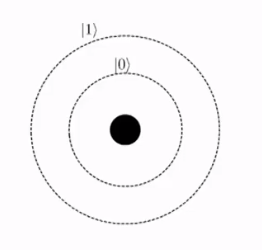

# An-Introduction-to-Quantum-Computing-by-Qiskit
Qiskit is an open-source SDK which is used to program IBM's quantum computers. Qiskit is useful for working with noisy quantum computers at the level of pulses, circuits, and algorithms. This is an introductory tutorial on quantum computing which will get you started with coding on qiskit.

# Prerequisites
This tutorial assumes knowledge of Basic Linear Algebra, Basic Quantum Mechanics and Basic Digital logic.

# Introduction
Analogous to bits used by classical computers, quantum computers use qubits as the basic unit of quantum information. But what are qubits exactly? Let's try to understand what they are. Think of an electron. Remember that the energy states of the electron are quantized and only take in discrete values. Now if we wish to represent a bit of information, we can restrict the energy of the system to be between the ground state and the first excited state. In this way the electron can only be at either of the two states -  or \ |1>"> 

But the electron does not decide as to where it wants to be, which is why we say that is in a superposition of the states  and \ |1>"> . A superposition of the states can be represented as a linear combination of the states  and \ |1>"> as  %2B\beta|1>">
